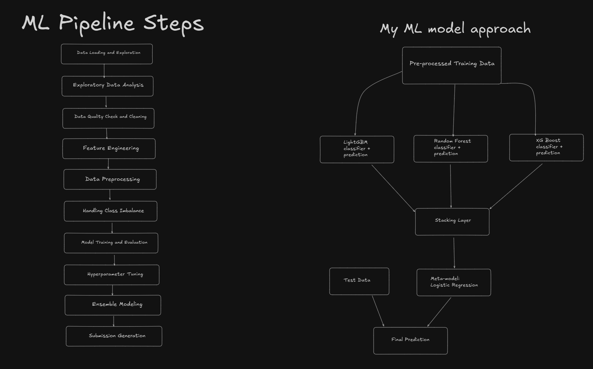
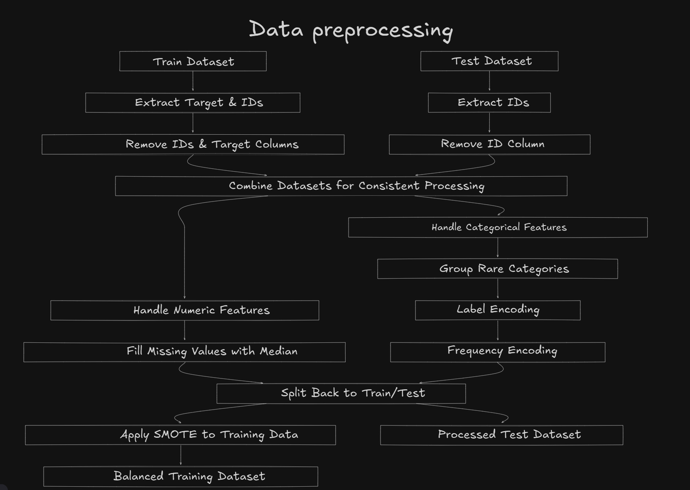
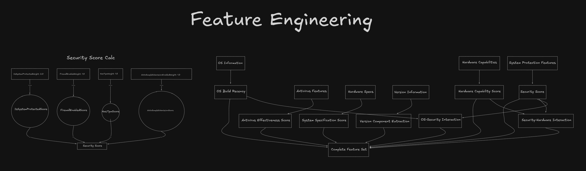
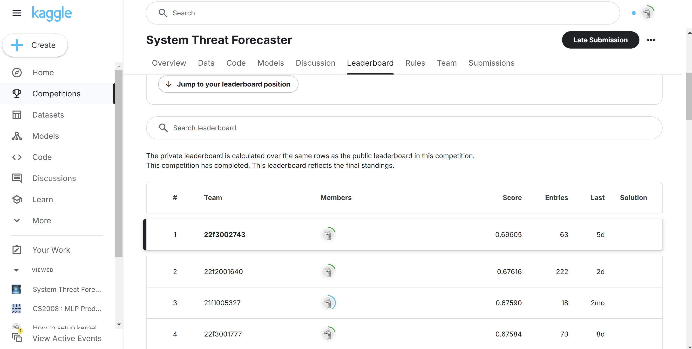

# System Threat Forecaster

Can You Forewarn a System Before It’s Compromised?

[Competition Link](https://www.kaggle.com/competitions/System-Threat-Forecaster)

## Description

The goal of this competition is to predict a system’s probability of getting infected by various families of malware, based on different properties of that system. The telemetry data containing these properties and the system infections was generated by threat reports collected by the system's antivirus software.

## Evaluation

Submissions are evaluated on `accuracy_score()` between the predicted classes and the true target. This section describes how submissions will be scored and how participants should format their submissions.

## Visualization

### My System Arch + Approach

### Data Preprocessing

### Feature Engineering

### Leaderboard
